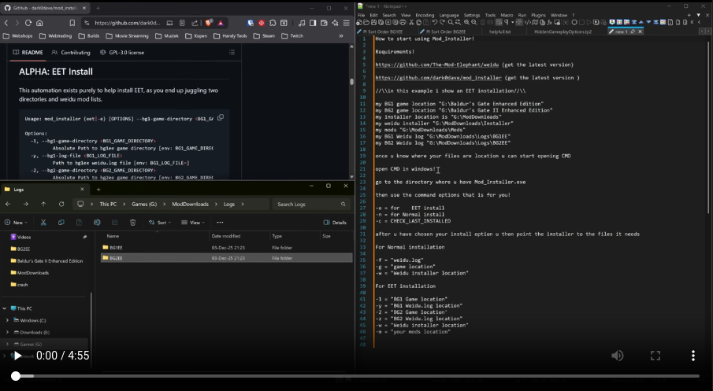
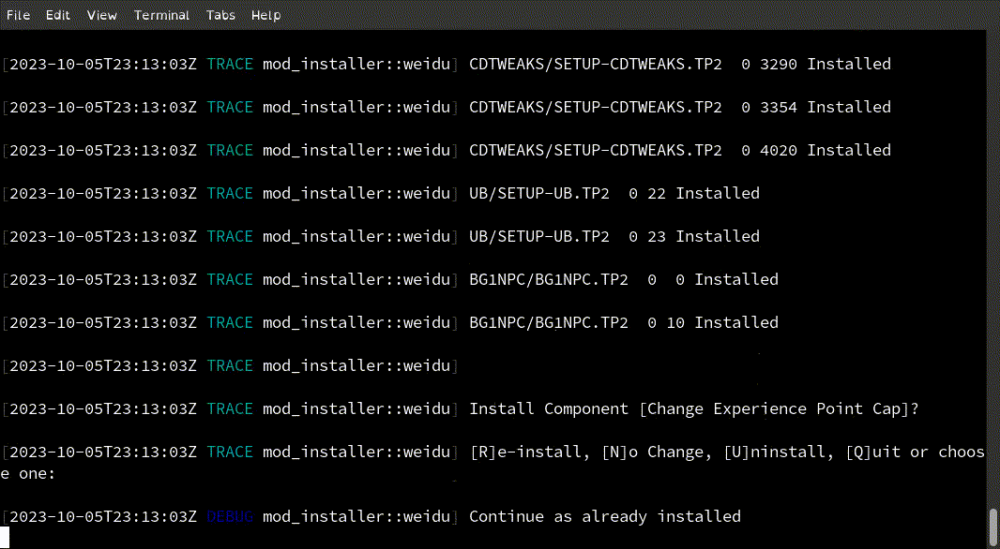

  # Infinity Engine Mod Installer
[](https://www.rust-lang.org/tools/install)
[](https://github.com/dark0dave/mod_installer/releases/latest)
[](https://github.com/dark0dave/mod_installer/releases/latest)
[](https://github.com/dark0dave/mod_installer/releases/latest)
[](https://github.com/dark0dave/mod_installer/actions/workflows/main.yaml)
[](./LICENSE)

      /\/\   ___   __| | (_)_ __  ___| |_ __ _| | | ___ _ __
     /    \ / _ \ / _` | | | '_ \/ __| __/ _` | | |/ _ \ '__|
    / /\/\ \ (_) | (_| | | | | | \__ \ || (_| | | |  __/ |
    \/    \/\___/ \__,_| |_|_| |_|___/\__\__,_|_|_|\___|_|

The Infinity Engine Mod Installer is a tool designed to automate the installation of mods for Infinity Engine games such as Baldur's Gate, Icewind Dale, and Planescape: Torment. It uses a file called "weidu.log" to determine which mods to install and how to install them.

## Usage

To use the Infinity Engine Mod Installer, you need to run it from the command line. Here's the basic structure of the command:

```sh
Usage: mod_installer(.exe) <COMMAND> [OPTIONS]

Commands:
  normal, -n  Normal install for (BG1EE,BG2EE,IWDEE) (STABLE)
  eet, -e     EET install for (eet) (ALPHA)
  help        Print this message or the help of the given subcommand(s)
```
Let's break down what each part means:

* mod_installer(.exe): This is the name of the program you're running.
[OPTIONS]: These are additional settings you can use to customize how the program works (we'll explain these in detail below).

## Born2BSalty Windows guide

[](https://github.com/user-attachments/assets/7c775551-848a-40c9-8fab-67a86ee6ca53)

## Normal Install

```sh
Usage: mod_installer {normal|-n} [OPTIONS] --log-file <LOG_FILE> --game-directory <GAME_DIRECTORY>

Options:
  -f, --log-file <LOG_FILE>
          Path to target log [env: LOG_FILE=]
  -g, --game-directory <GAME_DIRECTORY>
          Absolute Path to game directory [env: GAME_DIRECTORY=]
  -w, --weidu-binary <WEIDU_BINARY>
          Absolute Path to weidu binary [env: WEIDU_BINARY=] [default: /home/x/projects/bg_mods/tools/weidu/weidu]
  -m, --mod-directories <MOD_DIRECTORIES>
          Path to mod directories [env: MOD_DIRECTORIES=] [default: /home/x/projects/bg_mods/tools/mod_installer]
  ...
  -h, --help                             Print help
```

* --log-file <LOG_FILE>: This is where you tell the program where to find the "weidu.log" file, which contains the mods you want to install, please note this is not the same as the weidu.log file in the game directory.

* --game-directory <GAME_DIRECTORY>: This is where you tell the program where your game is installed.

* --mod-directories <MOD_DIRECTORIES>: This is where you tell the program where to find the mod files. This defaults to the current workgin directory

### Example Run

With binary or installed from cargo
```sh
mod_installer(.exe) --log-file dark0dave_weidu.log --game-directory ~/.steam/steam/steamapps/common/Baldur\'s\ Gate\ Enhanced\ Edition/ --mod-directories ~/Downloads/my_mods/
```

With cargo:
```sh
cargo run -- normal --log-file dark0dave_weidu.log --game-directory ~/.steam/steam/steamapps/common/Baldur\'s\ Gate\ Enhanced\ Edition/ --mod-directories ~/Downloads/my_mods/
```

## BETA: EET Install

This automation exists purely to help install EET, as you end up juggling two directories and weidu mod lists.


```sh
Usage: mod_installer {eet|-e} [OPTIONS] --bg1-game-directory <BG1_GAME_DIRECTORY> --bg1-log-file <BG1_LOG_FILE> --bg2-game-directory <BG2_GAME_DIRECTORY> --bg2-log-file <BG2_LOG_FILE> --mod-directories <MOD_DIRECTORIES>

Options:
  -1, --bg1-game-directory <BG1_GAME_DIRECTORY>
          Absolute Path to bg1ee game directory [env: BG1_GAME_DIRECTORY=]
  -y, --bg1-log-file <BG1_LOG_FILE>
          Path to bg1ee weidu.log file [env: BG1_LOG_FILE=]
  -2, --bg2-game-directory <BG2_GAME_DIRECTORY>
          Absolute Path to bg2ee game directory [env: BG2_GAME_DIRECTORY=]
  -z, --bg2-log-file <BG2_LOG_FILE>
          Path to bg2ee weidu.log file [env: BG2_LOG_FILE=]
  -w, --weidu-binary <WEIDU_BINARY>
          Absolute Path to weidu binary [env: WEIDU_BINARY=] [default: /home/x/projects/bg_mods/tools/weidu/weidu]
  -m, --mod-directories <MOD_DIRECTORIES>
          Path to mod directories [env: MOD_DIRECTORIES=] [default: /home/x/projects/bg_mods/tools/mod_installer]
  ...
  -h, --help Print help
```

* --bg1-log-file <LOG_FILE>: This is where you tell the program where to find the "weidu.log" file, which contains the mods you want to install, as the first part of the EET process. This is often referred to as the pre-EET section.

* --bg2-log-file <LOG_FILE>: Same as bg1-log-file, but for the bg2 part of EET, ie the log which is installed after the bg1 log is installed.

* --bg1-game-directory <GAME_DIRECTORY>: This is where you tell the program where your game is installed.

* --bg2-game-directory <GAME_DIRECTORY>: This is where you tell the program where your EET part (bg2) to be installed.

* --mod-directories <MOD_DIRECTORIES>: This is where you tell the program where to find the mod files. This defaults to the current workgin directory

## BETA: Download feature

This automation exists purely to help the install process. Currently its very limited. Users can supply the flag `--download` followed by the associated github zip url.

```sh
Usage: mod_installer -{e|n} ... --download
```

If a mod is missing users will be presented with the following prompt:

```sh
[2025-06-14T14:08:34Z INFO  mod_installer::utils] Missing mod: Component {
        tp_file: "SETUP-EEFIXPACK.TP2",
        name: "eefixpack",
        lang: "0",
        component: "0",
        component_name: "Core Fixes",
        sub_component: "",
        version: "Nightly 031225",
    }
[2025-06-14T14:08:34Z INFO  mod_installer::utils] Please provide mod url, or exit
```

Users can then input the required github zip url, and the mod_installer will download extract and install the provided mod.

## ALPHA: Scan feature

The mod installer can scan and detect what mods are available to you. It will however need a game directory to detect what mods can actually be installed.

```sh
Usage: mod_installer {scan|-s} [OPTIONS] --game-directory <GAME_DIRECTORY>
Options:
  -g, --game-directory <GAME_DIRECTORY>
          Absolute Path to game directory [env: GAME_DIRECTORY=]
  -f, --filter-by-selected-language <FILTER_BY_SELECTED_LANGUAGE>
          filter by selected language [default: ]
  -w, --weidu-binary <WEIDU_BINARY>
          Absolute Path to weidu binary [env: WEIDU_BINARY=] [default: /usr/bin/weidu]
  -m, --mod-directories <MOD_DIRECTORIES>
          Path to mod directories [env: MOD_DIRECTORIES=] [default: /home/x/projects/bg_mods/tools/mod_installer]
  ...
  -h, --help Print help
```

You can optionally supply a language to scan for, please note this is a fuzzy match. Something something I am doing my best here.

```sh
mod_installer(.exe) -s -m "." -g "." -f english
```
Example output:
```sh
~STRATAGEMS/SETUP-STRATAGEMS.TP2~ #0 #8070 // Improved Unseeing Eye: 35.21
~STRATAGEMS/SETUP-STRATAGEMS.TP2~ #0 #8080 // Improved Bodhi: 35.21
~STRATAGEMS/SETUP-STRATAGEMS.TP2~ #0 #8085 // Ascension version of Bodhi uses Improved-Bodhi abilities: 35.21
~STRATAGEMS/SETUP-STRATAGEMS.TP2~ #0 #8090 // Party's items are taken from them in Spellhold: 35.21
~STRATAGEMS/SETUP-STRATAGEMS.TP2~ #0 #8100 // Improved battle with Irenicus in Spellhold: 35.21
~STRATAGEMS/SETUP-STRATAGEMS.TP2~ #0 #8110 // Improved Sahuagin: 35.21
~STRATAGEMS/SETUP-STRATAGEMS.TP2~ #0 #8120 // Improved Beholder hive: 35.21
~STRATAGEMS/SETUP-STRATAGEMS.TP2~ #0 #8130 // Rebalanced troll regeneration: 35.21
~STRATAGEMS/SETUP-STRATAGEMS.TP2~ #0 #8140 // Improved Drow: 35.21
~STRATAGEMS/SETUP-STRATAGEMS.TP2~ #0 #8150 // Improved Watcher's Keep: 35.21
~STRATAGEMS/SETUP-STRATAGEMS.TP2~ #0 #8160 // Improved Fire Giant temple: 35.21
~STRATAGEMS/SETUP-STRATAGEMS.TP2~ #0 #8170 // Improved Sendai's Enclave: 35.21
~STRATAGEMS/SETUP-STRATAGEMS.TP2~ #0 #8180 // Improved Abazigal's Lair: 35.21
~STRATAGEMS/SETUP-STRATAGEMS.TP2~ #0 #8190 // Improved Minor Encounters: 35.21
~AJANTISBG2/AJANTISBG2.TP2~ #1 #0 // Sir Ajantis NPC for BGII: 20
~AJANTISBG2/AJANTISBG2.TP2~ #1 #1 // Install the unique BG(II):EE BAM for Ajantis' Family Shield: 20
~AJANTISBG2/AJANTISBG2.TP2~ #1 #3 // Installation of adult romance content: 20
~AJANTISBG2/AJANTISBG2.TP2~ #1 #5 // Ajantis kit choice: make Ajantis Cavalier: 20
~AJANTISBG2/AJANTISBG2.TP2~ #1 #41 // Select Ajantis' Friendship Dialogues and Romance Speed: -> Speed: 45 minutes real time minimum between Dialogues: 20
~AJANTISBG2/AJANTISBG2.TP2~ #1 #42 // Select Ajantis' Friendship Dialogues and Romance Speed: -> Speed: 30 minutes real time minimum between Dialogues: 20
~AJANTISBG2/AJANTISBG2.TP2~ #1 #43 // Select Ajantis' Friendship Dialogues and Romance Speed: -> Speed: 15 minutes real time minimum between Dialogues: 20
~AJANTISBG2/AJANTISBG2.TP2~ #1 #44 // Select Ajantis' Friendship Dialogues and Romance Speed: -> Speed: 1 hour 30 minutes (extended) real time minimum between Dialogues: 20
~C#SOLAUFEIN/C#SOLAUFEIN.TP2~ #1 #0 // Solaufein's Rescue: Jastey's Solaufein NPC for BGII: 5.0
~C#SOLAUFEIN/C#SOLAUFEIN.TP2~ #1 #1 // Give Solaufein in Ust Natha the Mod's Portrait: 5.0
~C#SOLAUFEIN/C#SOLAUFEIN.TP2~ #1 #2 // Enable Drider Animations in this Mod: 5.0
~C#SOLAUFEIN/C#SOLAUFEIN.TP2~ #1 #3 // Install alternative portrait #2 from Chinasky: 5.0
~C#SOLAUFEIN/C#SOLAUFEIN.TP2~ #1 #4 // Install Detection for Drow PC: 5.0
~DIVINE_REMIX/SETUP-DIVINE_REMIX.TP2~ #0 #10 // Install new spells -> Overwrite spells from other mods: v9_Test_Build_2
~DIVINE_REMIX/SETUP-DIVINE_REMIX.TP2~ #0 #11 // Install new spells -> Only add spells if not present from other mods: v9_Test_Build_2
~DIVINE_REMIX/SETUP-DIVINE_REMIX.TP2~ #0 #50 // Remove Cleric Kits -> Remove Only Mod Kits: v9_Test_Build_2
~DIVINE_REMIX/SETUP-DIVINE_REMIX.TP2~ #0 #51 // Remove Cleric Kits -> Remove All Kits: v9_Test_Build_2
~DIVINE_REMIX/SETUP-DIVINE_REMIX.TP2~ #0 #52 // Remove Druid Kits -> Remove Only Mod Kits: v9_Test_Build_2
~DIVINE_REMIX/SETUP-DIVINE_REMIX.TP2~ #0 #53 // Remove Druid Kits -> Remove All Kits: v9_Test_Build_2
~DIVINE_REMIX/SETUP-DIVINE_REMIX.TP2~ #0 #54 // Remove Paladin Kits -> Remove Only Mod Kits: v9_Test_Build_2
~DIVINE_REMIX/SETUP-DIVINE_REMIX.TP2~ #0 #55 // Remove Paladin Kits -> Remove All Kits: v9_Test_Build_2
~DIVINE_REMIX/SETUP-DIVINE_REMIX.TP2~ #0 #56 // Remove Ranger Kits -> Remove Only Mod Kits: v9_Test_Build_2
~DIVINE_REMIX/SETUP-DIVINE_REMIX.TP2~ #0 #57 // Remove Ranger Kits -> Remove All Kits: v9_Test_Build_2
~DIVINE_REMIX/SETUP-DIVINE_REMIX.TP2~ #0 #100 // Cleric Remix -> Use conventional format for cleric kits: v9_Test_Build_2
~DIVINE_REMIX/SETUP-DIVINE_REMIX.TP2~ #0 #101 // Cleric Remix -> Use new format for cleric kits: v9_Test_Build_2
~DIVINE_REMIX/SETUP-DIVINE_REMIX.TP2~ #0 #103 // Install Silverstar of Selune Cleric Kit: v9_Test_Build_2
~DIVINE_REMIX/SETUP-DIVINE_REMIX.TP2~ #0 #106 // Install Nightcloak of Shar Cleric Kit: v9_Test_Build_2
~DIVINE_REMIX/SETUP-DIVINE_REMIX.TP2~ #0 #107 // Install Holy Strategist of the Red Knight Cleric Kit: v9_Test_Build_2
~DIVINE_REMIX/SETUP-DIVINE_REMIX.TP2~ #0 #109 // Install Battleguard of Tempus Cleric Kit: v9_Test_Build_2
~DIVINE_REMIX/SETUP-DIVINE_REMIX.TP2~ #0 #112 // Install Painbearer of Ilmater Cleric Kit: v9_Test_Build_2
~DIVINE_REMIX/SETUP-DIVINE_REMIX.TP2~ #0 #115 // Install Firewalker of Kossuth Cleric Kit: v9_Test_Build_2
~DIVINE_REMIX/SETUP-DIVINE_REMIX.TP2~ #0 #118 // Install Authlim of Iyachtu Xvim Cleric Kit: v9_Test_Build_2
~DIVINE_REMIX/SETUP-DIVINE_REMIX.TP2~ #0 #121 // Install Lorekeeper of Oghma Cleric Kit: v9_Test_Build_2
~DIVINE_REMIX/SETUP-DIVINE_REMIX.TP2~ #0 #124 // Install Heartwarder of Sune Cleric Kit: v9_Test_Build_2
~DIVINE_REMIX/SETUP-DIVINE_REMIX.TP2~ #0 #127 // Install Feywarden of Corellon Cleric Kit: v9_Test_Build_2
~DIVINE_REMIX/SETUP-DIVINE_REMIX.TP2~ #0 #130 // Install Strifeleader of Cyric Cleric Kit: v9_Test_Build_2
~DIVINE_REMIX/SETUP-DIVINE_REMIX.TP2~ #0 #133 // Install Holy Justice of Tyr Cleric Kit: v9_Test_Build_2
~DIVINE_REMIX/SETUP-DIVINE_REMIX.TP2~ #0 #200 // Druid Remix: v9_Test_Build_2
~DIVINE_REMIX/SETUP-DIVINE_REMIX.TP2~ #0 #203 // Install Oozemaster Druid kit: v9_Test_Build_2
~DIVINE_REMIX/SETUP-DIVINE_REMIX.TP2~ #0 #403 // Install Bowslinger Ranger Kit: v9_Test_Build_2
~DIVINE_REMIX/SETUP-DIVINE_REMIX.TP2~ #0 #406 // Install Feralan Ranger Kit: v9_Test_Build_2
~DIVINE_REMIX/SETUP-DIVINE_REMIX.TP2~ #0 #409 // Install Forest Runner Ranger Kit: v9_Test_Build_2
~DIVINE_REMIX/SETUP-DIVINE_REMIX.TP2~ #0 #412 // Install Justifier Ranger Kit: v9_Test_Build_2
~DIVINE_REMIX/SETUP-DIVINE_REMIX.TP2~ #0 #415 // Install Wilderness Runner Ranger Kit: v9_Test_Build_2
~DIVINE_REMIX/SETUP-DIVINE_REMIX.TP2~ #0 #600 // Install Battleguard of Tempus Kit for Branwen: v9_Test_Build_2
~DIVINE_REMIX/SETUP-DIVINE_REMIX.TP2~ #0 #605 // Change Jaheira to Neutral Good: v9_Test_Build_2
~DIVINE_REMIX/SETUP-DIVINE_REMIX.TP2~ #0 #610 // Install Nightcloak of Shar Kit for Viconia: v9_Test_Build_2
~DIVINE_REMIX/SETUP-DIVINE_REMIX.TP2~ #0 #1000 // Implement sphere system for regular divine spells: v9_Test_Build_2
~DIVINE_REMIX/SETUP-DIVINE_REMIX.TP2~ #0 #1001 // Implement sphere system for High-Level Abilities: v9_Test_Build_2
~DIVINE_REMIX/SETUP-DIVINE_REMIX.TP2~ #0 #3000 // Alternative Item Usability Scheme for Cleric Kits: v9_Test_Build_2
~ASCENSION/ASCENSION.TP2~ #0 #0 // Rewritten Final Chapter of Throne of Bhaal: 2.1.0
~ASCENSION/ASCENSION.TP2~ #0 #10 // Balthazar can be redeemed: 2.1.0
~ASCENSION/ASCENSION.TP2~ #0 #20 // Improved Sarevok-Player Interactions: 2.1.0
~ASCENSION/ASCENSION.TP2~ #0 #30 // Improved Imoen-Player Interactions in Throne of Bhaal: 2.1.0
~ASCENSION/ASCENSION.TP2~ #0 #40 // Restored Bhaalspawn Powers: 2.1.0
~ASCENSION/ASCENSION.TP2~ #0 #50 // Improved Slayer Transformation: 2.1.0
~ASCENSION/ASCENSION.TP2~ #0 #60 // Expanded Epilogues for Bioware NPCs -> David Gaider's expanded epilogues for Bioware NPCs: 2.1.0
~ASCENSION/ASCENSION.TP2~ #0 #61 // Expanded Epilogues for Bioware NPCs -> Alternate epilogues by Shawne: 2.1.0
~ASCENSION/ASCENSION.TP2~ #0 #1000 // Tougher Abazigal: 2.1.0
~ASCENSION/ASCENSION.TP2~ #0 #1100 // Tougher Balthazar: 2.1.0
~ASCENSION/ASCENSION.TP2~ #0 #1200 // Tougher Demogorgon: 2.1.0
~ASCENSION/ASCENSION.TP2~ #0 #1300 // Tougher Gromnir: 2.1.0
~ASCENSION/ASCENSION.TP2~ #0 #1400 // Tougher Illasera: 2.1.0
~ASCENSION/ASCENSION.TP2~ #0 #1500 // Tougher Yaga-Shura: 2.1.0
~ASCENSION/ASCENSION.TP2~ #0 #2000 // Full-body portrait for Bodhi: 2.1.0
~ASCENSION/ASCENSION.TP2~ #0 #2100 // Alternate Balthazar portrait, by Cuv: 2.1.0
~ASCENSION/ASCENSION.TP2~ #0 #2200 // Extended Epilogues for additional Beamdog NPCs, by shawne: 2.1.0
~ASCENSION/ASCENSION.TP2~ #0 #2300 // Sharper portraits of Abazigal and Gromnir for the Enhanced Edition, by DavidW: 2.1.0
~ASCENSION/ASCENSION.TP2~ #0 #2400 // Slightly improved cutscenes, by DavidW: 2.1.0
```

#### Notes

- Only github is supported (more to come I promise!)
- No version check is performed, ie it downloads what ever is passed and that must be a zip file


## FAQ

The Infinity Engine Mod Installer looks at a "weidu.log" file that you provide. This file contains information about mods you want to install. The tool then goes through this list and installs each mod automatically. This saves you time and effort, as you don't have to manually install each mod one by one.

### Weidu Log

The Weidu log file contains a list of installed mods and is typically found in your game directory if you have previously installed mods. Here's an example of what a Weidu log might look like:

```sh
// Log of Currently Installed WeiDU Mods
// The top of the file is the 'oldest' mod
// ~TP2_File~ #language_number #component_number // [Subcomponent Name -> ] Component Name [ : Version]
~TEST_MOD_NAME_1/TEST.TP2~ #0 #0 // test mod one
```
If you're new to modding Infinity Engine games, we recommend installing mods manually first to familiarize yourself with the process. This will help you understand how mods work and how they interact with your game.

### Getting Started with Weidu Logs

If you're looking for an example `weidu.log` to get started:

Check online forums and modding communities. Experienced players and modders often share their mod lists and corresponding Weidu logs.
Look for "mod packs" or "recommended mod lists" for your specific game. These often come with pre-configured Weidu logs.
Start with a small number of popular mods and gradually build up your log as you become more comfortable with the modding process.
Some mod managers for Infinity Engine games can generate Weidu logs based on your selected mods.

Remember, Weidu is a powerful tool, but it's important to understand what you're installing. Always back up your game files before installing mods, and be aware that some mods may conflict with others.

### Demo
We have a short video that shows how the tool works:



### What options can I use?

**Don't panic** you can use the help command to find all the options listed below:

* -h, --help

  What it does: This shows a help message with information about how to use the program.
  How to use it: Just add this option to your command if you need help.
  Example: mod_installer --help

#### Normal Install

```sh
mod_installer(.exe) normal --help
```

Here's a detailed explanation of all the options you can use, for a normal install:

* -f, --log-file <LOG_FILE>

  > What it does: This tells the program where to find the "weidu.log" file.

  > How to use it: Replace <LOG_FILE> with the path to your "weidu.log" file.

  > Example: --log-file C:\Games\Baldur's Gate\weidu.log


* -g, --game-directory <GAME_DIRECTORY>


  > What it does: This tells the program where your game is installed.

  > How to use it: Replace <GAME_DIRECTORY> with the path to your game folder.

  > Example: --game-directory C:\Games\Baldur's Gate


#### EET Install

```sh
mod_installer(.exe) eet --help
```
* -1, --bg1-game-directory <BG1_GAME_DIRECTORY>

  > What it does: This tells the program where your bg1ee is installed.

  > How to use it: Replace <BG1_GAME_DIRECTORY> with the path to your game folder.

  > Example: --bg1-game-directory C:\Games\Baldur's Gate Enhanced Edition

* -y, --bg1-log-file <BG1_LOG_FILE>


  > What it does: This tells the program where to find the "weidu.log" file. For the BG1/pre-EET Install.

  > How to use it: Replace <BG1_LOG_FILE> with the path to your "weidu.log" file.

  > Example: --bg1-log-file C:\pre-eet-weidu.log

* -2, --bg2-game-directory <BG2_GAME_DIRECTORY>

  > What it does: This tells the program where your bg2ee is installed.

  > How to use it: Replace <BG1_GAME_DIRECTORY> with the path to your game folder.

  > Example: --bg2-game-directory C:\Games\Baldur's Gate II Enhanced Edition

* -z, --bg2-log-file <BG2_LOG_FILE>

  > What it does: This tells the program where to find the "weidu.log" file. For the BG2EE/EET Install.

  > How to use it: Replace <BG2_LOG_FILE> with the path to your "weidu.log" file.

  > Example: --bg2-log-file C:\eet-weidu.log

#### Common Options

These flags work for either of the above commands

* -w, --weidu-binary <WEIDU_BINARY>


  > What it does: This tells the program where to find the WeiDU program.

  > How to use it: Replace <WEIDU_BINARY> with the path to your WeiDU executable.

  > Example: --weidu-binary C:\WeiDU\weidu.exe


* -m, --mod-directories <MOD_DIRECTORIES>


  > What it does: This tells the program where to find the mod files.

  > How to use it: Replace <MOD_DIRECTORIES> with the path(s) to your mod folder(s).

  > Example: --mod-directories C:\BG_Mods


* -l, --language <LANGUAGE>


  > What it does: This sets the language for the game and mods.

  > How to use it: Replace <LANGUAGE> with your preferred language code.

  > Default: en_US (English)

  > Example: --language fr_FR (for French)


* -d, --depth <DEPTH>


  > What it does: This sets how deep the program should look in folders for mod files.

  > How to use it: Replace <DEPTH> with a number.

  > Default: 5

  > Example: --depth 3


* -s, --skip-installed


  > What it does: This makes the program check what's already installed and skip those mods.

  > How to use it: Just add this option to your command if you want to use it.

  > Default: This is on by default.

  > Example: --skip-installed=false


* -a, --abort-on-warnings


  > What it does: This makes the program stop if it encounters any warnings.

  > How to use it: Just add this option to your command if you want to use it.

  > Default: This is on by default.

  > Example: --abort-on-warnings=false


* -t, --timeout <TIMEOUT>


  > What it does: This sets how long the program will wait for each mod to install before giving up.

  > How to use it: Replace <TIMEOUT> with a number of seconds.

  > Default: 3600 (1 hour)

  > Example: --timeout 7200 (2 hours)

* -i, --tick <TICK>


  > What it does: This sets how long the program will wait between polling weidu.

  > How to use it: Replace <TIMEOUT> with a number of milliseconds.

  > Default: 500 (1/2 a second)

  > Example: --tick 1000

* -u, --weidu-log-mode <WEIDU_LOG_MODE>


  > What it does: This sets how WeiDU should log its actions.

  > How to use it: Replace <WEIDU_LOG_MODE> with a WeiDU log mode.

  > Default: --autolog

  > Example: --weidu-log-mode --log

* -o, --overwrite

  > What it does: This tells the mod_installer to overwrite mod directories in the game folder.

  > How to use it: Pass the overwrite flag to the mod_installer

  > Default: false

  > Example: -o


* -x, --strict-matching


  > What it does: This makes the program more strict about matching mod versions and components.

  > How to use it: Just add this option to your command if you want to use it.

  > Default: This is off by default.

  > Example: --strict-matching

* -c, --check_last_installed


  > What it does: This has the mod_installer compare what it just installed vs the last line in the weidu.log file.

  > How to use it: Just add this option to your command if you want to use it.

  > Default: This is off by default.

  > Example: -c --check_last_installed

* -V, --version


  > What it does: This shows what version of the program you're using.

  > How to use it: Just add this option to your command if you want to check the version.

  > Example: mod_installer --version

### Configuring the Parser

See the `example_config.toml` for defaults parser uses. Here we provide a brief breakdown of what each configuration does:

Name|Category|Description|Example
----|----|:----|----
| in_progress_words | A list of words | Checks if weidu is currently running | ["installing", "creating", ...]
| useful_status_words | A list of words | Provides feedback on the weidu process | ["copied", "copying", ...]
| choice_words | A list of words | Words which check if weidu wants user input | ["choice", "choose", ...]
| choice_phrase | A list of phrases | Phrases which check if weidu wants user input | ["do you want", "would you like", ...]
| completed_with_warnings | A list of phrases | Phrases which wiedu uses if it finishes with warning | ["installed with warnings", ...]
| failed_with_error | A list of phrases | Phrases which wiedu uses if it finishes with an error | ["not installed due to errors", ...]
| finished | A list of phrases | Phrases which wiedu uses if it finishes successfully | ["successfully installed","process ended", ...]

Note: **All words/phrases are compared in lowercase ascii.**

If you wish to changes the above; or you are using a different game language (apologies for not translating all of this); have found a exemption; or just want to change the way the parser works you'll need to create your own mod_installer.toml.

We use the rust crate [`confy`](https://crates.io/crates/confy) to load configuration. Confy uses the rust crate [`directories`](https://crates.io/crates/directories) to find the the expected path for your operating system. The `directories` crate uses:

- the XDG base directory and the XDG user directory specifications on Linux
- the Known Folder API on Windows
- the Standard Directories guidelines on macOS

In order to save you some time reading all the above we will put the expected locations below:

- Windows: `{FOLDERID_RoamingAppData}\mod_installer\config`
- Macos: `$HOME/Library/Application Support/mod_installer/config.toml`
- Linux: `$XDG_CONFIG_HOME/mod_installer/config.toml` or `$HOME/.config/mod_installer/config.toml`

### Logging

You can show more install information by setting the `RUST_LOG` environment variable. Here are some of the levels you can use:

For some additional information:

```sh
RUST_LOG=INFO mod_installer [OPTIONS]
```

For detailed information about each step:
```sh
RUST_LOG=DEBUG mod_installer [OPTIONS]
```

For absolutely everything, including WeiDU logs:
```sh
RUST_LOG=TRACE mod_installer [OPTIONS]
```

For more information on logging visit the rust crate [`log`](https://crates.io/crates/log).

### Building

We offer two ways of building the mod_installer. Nix or cargo directly.

#### Cargo

```sh
cargo build --release
```

#### Nix

```sh
nix build -f default.nix
```
